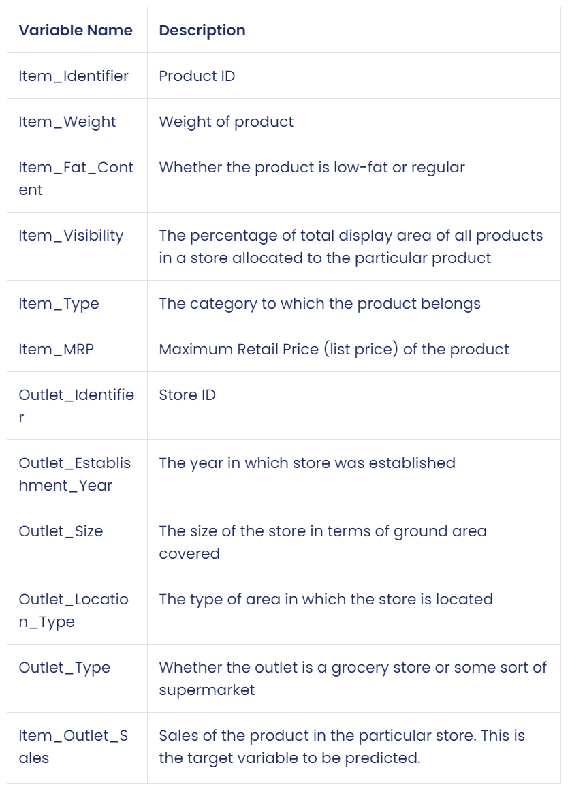
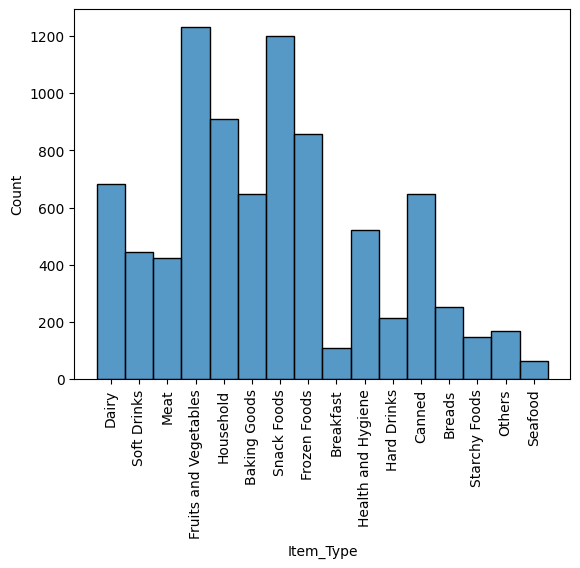
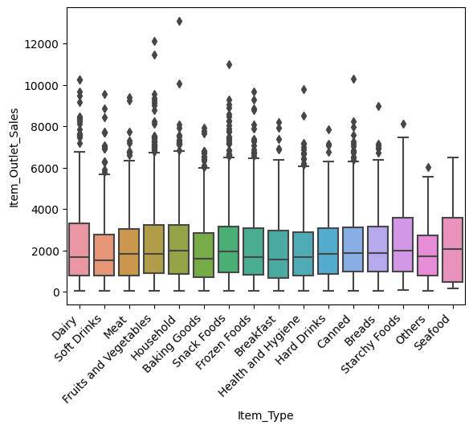

# Preditction of Product Sales
## Analyzing Diffrent factors that effect sales

**Michael Vidales** 

### Business problem:

Here is where you state the business problem you were trying to solve

### Data:
[Big Mart Sales Prediction](https://datahack.analyticsvidhya.com/contest/practice-problem-big-mart-sales-iii/)

From this dataset, there were 8523 rows and 11 columns 

## Data Dictionary:

## Methods
- During the exploratory data analysis, a boxplot and histogram was visualized for each numeric datatype column. 
- Also, a barplot was visualized for each categorical column. 
- This gave a good baseline for all of the numeric and categorical columns for univariate EDA.

## Results

### Here are examples of how to embed images from your sub-folder

#### Visual 1 Title

> Sentence about visualization.

#### Visual 2 Title

>

## Model

Describe your final model

Report the most important metrics

Refer to the metrics to describe how well the model would solve the business problem

## Recommendations:

More of your own text here

## Limitations & Next Steps

More of your own text here

### For further information

For any additional questions, please contact **email**
